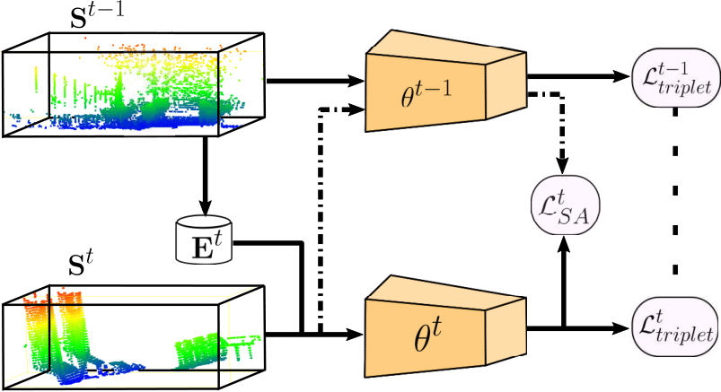

# InCloud: Incremental Learning for Point Cloud Place Recognition

Paper URL: [https://arxiv.org/abs/2203.00807](https://arxiv.org/abs/2203.00807?style=centerme)

## Abstract  
Place recognition is a fundamental component of robotics, and has seen tremendous improvements through the use of deep learning models in recent years. Networks can  
experience significant drops in performance when deployed in unseen or highly dynamic environments, and require additional training on the collected data. However naively finetuning on new training distributions can cause severe degradation of performance on previously visited domains, a phenomenon known as catastrophic forgetting. In this paper we address the problem of incremental learning for point cloud place recognition and introduce InCloud, a structure-aware distillation-based approach which preserves the higher-order structure of the network’s embedding space. We introduce several challenging new benchmarks on four popular and large-scale LiDAR datasets (Oxford, MulRan, In-house and KITTI) showing broad improvements in point cloud place recognition performance over a variety of network architectures. To the best of our knowledge, this work is the first to effectively apply incremental learning for point cloud place recognition.

## Code Release  
Upon acceptance of our submission we will release code to accomplish the following: 
- Dataloaders and pre-processing scripts for the Oxford, NUS, MulRan and KITTI datasets  
- Training and evaluation code for the incremental learning approaches included in our paper  
- Pre-trained checkpoints for key results included in our paper
